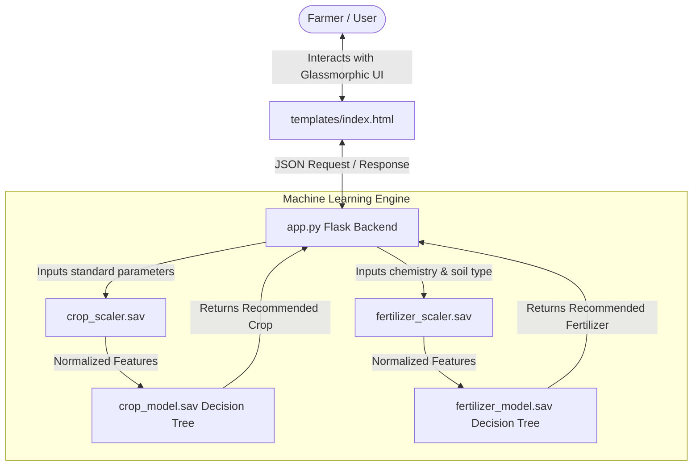
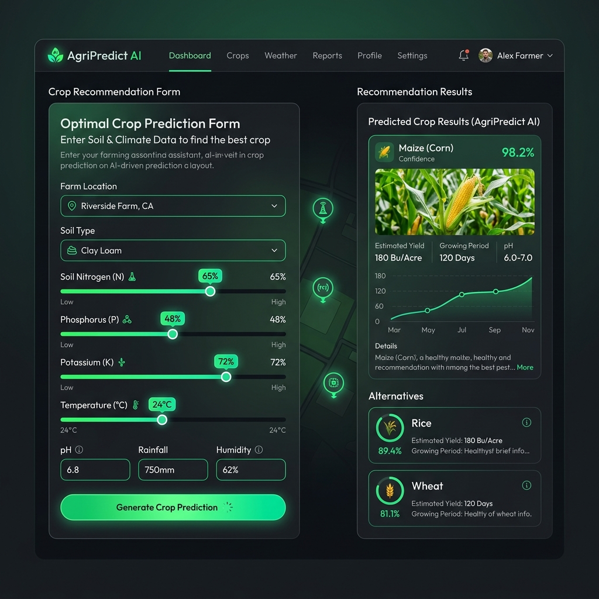

# 🌱 AgriPredict AI — Intelligent Farming Engine

AgriPredict AI is a modern, machine learning-powered web application designed to help farmers, agriculturalists, and students maximize crop yields and soil fertility. It analyzes ground chemistry and weather parameters to recommend **ideal crop choices** and **optimal fertilizer blends** in real-time.

Developed as part of the **AICTE Internship (Week 3)**, this project combines robust Machine Learning classifiers with a premium, responsive glassmorphic web interface.

---

## 🗺️ System Architecture & Workflow

This project is built using a decoupled architecture:
1. **Frontend**: A sleek, dark-mode, glassmorphic UI built with standard HTML5, premium styling (Outfit & Inter fonts, CSS variables, glowing badges, and layout-driven micro-interactions), and vanilla JavaScript.
2. **Backend**: A robust Flask micro-framework serving two pre-trained Scikit-Learn models.
3. **ML Pipeline**: Jupyter notebooks detailing the exploratory data analysis (EDA), data cleaning, scaling, model training, and performance metrics.



---

## 📂 Project Directory Structure

Here is the exact layout of the codebase to help you navigate:

```text
week3/
├── app.py                         # Main Flask backend server with API endpoints
├── crop_model.sav                 # Pre-trained Crop Prediction ML model (Decision Tree)
├── crop_scaler.sav                # Pre-fitted StandardScaler for Crop features
├── fertilizer_model.sav           # Pre-trained Fertilizer Recommendation ML model (Decision Tree)
├── fertilizer_scaler.sav          # Pre-fitted StandardScaler for Fertilizer features
├── Crop__Prediction.ipynb         # Jupyter Notebook detailing Crop model development
├── Fertilizer recommendation.ipynb # Jupyter Notebook detailing Fertilizer model development
├── templates/
│   └── index.html                 # Sleek UI layout with crop and fertilizer forms
└── static/
    ├── css/
    │   └── style.css              # Premium responsive stylesheet (Dark-mode, Glassmorphism, animations)
    └── js/
        └── main.js                # Form submission, live slider badges, and dynamic UI rendering
```

---

## 🧠 Machine Learning Overview

The engine utilizes **Decision Tree Classifier** models, which perform exceptionally well on structured soil and climatic datasets.

### 1. Crop Prediction Model
*   **Purpose**: Analyzes local ground and atmospheric parameters to suggest the most lucrative crop to grow.
*   **Model**: Scikit-Learn `DecisionTreeClassifier`
*   **Test Accuracy**: **~98.4%**
*   **Features Used (7)**:
    1.  `Nitrogen (N)` (mg/kg or ppm)
    2.  `Phosphorus (P)` (mg/kg or ppm)
    3.  `Potassium (K)` (mg/kg or ppm)
    4.  `Temperature` (°C)
    5.  `Relative Humidity` (%)
    6.  `Soil pH` (0–14)
    7.  `Average Rainfall` (mm)
*   **Supports 22 Crops**: *Rice, Maize, Jute, Cotton, Coconut, Papaya, Orange, Apple, Muskmelon, Watermelon, Grapes, Mango, Banana, Pomegranate, Lentil, Blackgram, Mungbean, Mothbeans, Pigeonpeas, Kidneybeans, Chickpea, and Coffee.*

### 2. Fertilizer Recommendation Model
*   **Purpose**: Recommends the specific fertilizer blend required based on current soil parameters and targeted crop.
*   **Model**: Scikit-Learn `DecisionTreeClassifier`
*   **Test Accuracy**: **100.0%** (small, highly structured dataset)
*   **Features Used (8)**:
    1.  `Ambient Temperature` (°C)
    2.  `Relative Humidity` (%)
    3.  `Soil Moisture` (%)
    4.  `Soil Type` (encoded numerically: *Black, Clayey, Loamy, Red, Sandy*)
    5.  `Crop Type` (encoded numerically: *Barley, Cotton, Ground Nuts, Maize, Millets, Oil seeds, Paddy, Pulses, Sugarcane, Tobacco, Wheat*)
    6.  `Nitrogen` (ppm)
    7.  `Potassium` (ppm)
    8.  `Phosphorous` (ppm)
*   **Recommends 7 Fertilizer Blends**: *Urea, DAP, 14-35-14, 28-28, 17-17-17, 20-20, and 10-26-26.*

---

## 🖥️ User Interface Showcase

Below is a visual preview of the premium, responsive **AgriPredict AI Dashboard**. It features a modern dark-mode design with elegant glassmorphic panels, glowing numerical state-badges, custom SVG indicators, and real-time input sliders.



---

## ⚡ Setup and Installation

Follow these quick steps to set up and run AgriPredict AI on your local computer:

### ⚙️ Prerequisites
Ensure you have **Python 3.8+** installed. You can check your version by running:
```bash
python --version
```

### 📦 Installation
1.  **Clone or Open the workspace**:
    Ensure you are in the `week3/` directory of the project:
    ```bash
    cd week3
    ```

2.  **Create a Virtual Environment** (Optional but highly recommended):
    ```bash
    python -m venv venv
    
    # On Windows (PowerShell/CMD)
    .\venv\Scripts\activate
    
    # On macOS/Linux
    source venv/bin/activate
    ```

3.  **Install Required Dependencies**:
    Create a `requirements.txt` file (or use the one in this directory) and install using:
    ```bash
    pip install -r requirements.txt
    ```
    *If you don't have `requirements.txt` yet, run:*
    ```bash
    pip install Flask numpy pandas scikit-learn seaborn matplotlib
    ```

### 🚀 Running the App
1.  Run the Flask app server:
    ```bash
    python app.py
    ```
2.  Open your browser and navigate to:
    ```text
    http://127.0.0.1:5000/
    ```
3.  **Enjoy the premium interactive AgriPredict AI dashboard!**

---

## 🎨 User Interface Features

- **Toggle Tabs**: Seamlessly switch between the **Crop Prediction** and **Fertilizer Guide** forms.
- **Interactive Sliders**: Move the sliders to dynamically change parameter values with real-time numeric badges.
- **Smart Result Card**: Displays a customized recommendation card with matching vector icon, description, and metric pills.
- **Session History Log**: Tracks all recommendations made during your current browsing session with quick-glance parameters.
- **Connected Pulse Indicator**: Shows real-time server connectivity status.

---

## 🏆 Internship Context

This repository is submitted by **E.V.B.J. Swaroop** for **Week 3** of the **AICTE Internship** program. 
- GitHub Code Repository: [Crop_Fertilizer_Prediction on GitHub](https://github.com/RGS-AI/AICTE_Internships/tree/main/2025/April_2025/Crop_Fertilizer_Prediction)
